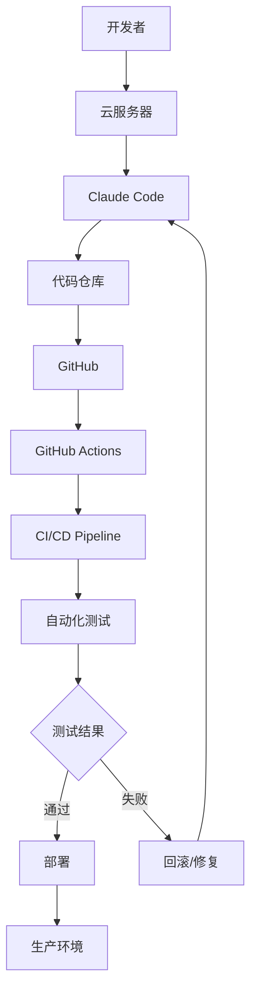
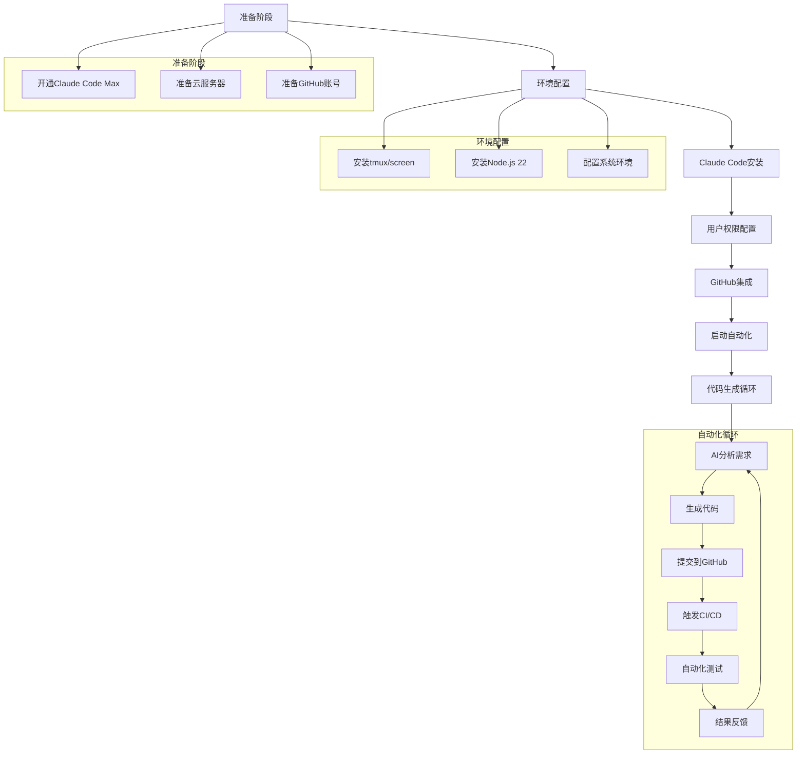

# Claude Code + 云服务器 + GitHub：实现无人监管24小时全自动写代码
## 概述
经过这个周末的摸索，终于找到使用Claude Code来搭建一套可以完整24小时不间断全自动的写代码系统！

下面详细介绍如何使用Claude Code、云服务器和GitHub搭建一个24小时无人监管的自动化编程环境。通过这套系统，您可以让AI助手自动编写代码、提交代码到GitHub，并通过GitHub Actions实现CI/CD自动化测试，形成一个完整的自动化开发闭环。

**重要提醒：** 建议使用海外云服务器（如AWS、DigitalOcean等），确保网络能够稳定连接GitHub，避免因网络问题导致自动化流程中断。

也可以直接在某鱼上直接买腾讯云海外的服务器

## 先看效果
- 电脑端  
  Claude Code在服务器上自动执行
  

- 手机端  
  使用手机随时查看任务状态!


- github代码仓库  
  Claude Code全自动提交代码
  


## 系统架构



## 整体流程



## 准备条件

### 必要资源

1. **Claude Code Max订阅(优惠和开通方法可微信私聊我)**
   - 价值：$100/月
   - 提供更大的上下文窗口和更强的代码生成能力

2. **云服务器**
   - 配置：无特殊要求，基础配置即可（1核2G内存起步）
   - 系统：推荐Debian 12或Ubuntu 22.04+
   - 地域：**强烈建议选择海外云服务器**（如美国、新加坡、香港等）
   - 原因：保证网络能稳定连接GitHub，避免网络问题导致的自动化中断
   - 用途：24小时运行Claude Code
   - 推荐服务商：AWS、DigitalOcean、Vultr、Linode等

3. **GitHub账号**
   - 用于代码托管和版本控制
   - 需要配置GitHub Actions权限

## 环境准备

## 核心环境配置

这些配置步骤建议使用AI工具（如Cursor）来生成完整脚本：

### 基础环境
```bash
sudo apt update && sudo apt upgrade -y
sudo apt install -y tmux screen curl wget git vim htop
```

### Node.js环境
```bash
curl -fsSL https://deb.nodesource.com/setup_22.x | sudo -E bash -
sudo apt-get install -y nodejs
```

### Claude Code
```bash
wget -q https://pub-7c3a1b7d65a64aa2bcea1b0eedd6d63a.r2.dev/anthropic-ai-claude-code-1.0.31.tgz
npm install -g anthropic-ai-claude-code-1.0.31.tgz
```

### GitHub CLI
```bash
curl -fsSL https://cli.github.com/packages/githubcli-archive-keyring.gpg | sudo dd of=/usr/share/keyrings/githubcli-archive-keyring.gpg
echo "deb [arch=$(dpkg --print-architecture) signed-by=/usr/share/keyrings/githubcli-archive-keyring.gpg] https://cli.github.com/packages stable main" | sudo tee /etc/apt/sources.list.d/github-cli.list > /dev/null
sudo apt update && sudo apt install -y gh
```

### 用户配置
```bash
sudo useradd -m -s /bin/bash cc
ssh-keygen -t ed25519 -C "your-email@example.com" -f ~/.ssh/github_key -N ""
```

## 启动自动化系统

### 1. 核心安装命令

**系统环境准备：**
```bash
# 更新系统
sudo apt update && sudo apt upgrade -y

# 安装基础工具
sudo apt install -y tmux screen curl wget git vim htop

# 安装Node.js 22
curl -fsSL https://deb.nodesource.com/setup_22.x | sudo -E bash -
sudo apt-get install -y nodejs
```

**Claude Code安装：**
```bash
# 下载并安装Claude Code
wget -q https://pub-7c3a1b7d65a64aa2bcea1b0eedd6d63a.r2.dev/anthropic-ai-claude-code-1.0.31.tgz
npm install -g anthropic-ai-claude-code-1.0.31.tgz
```

**GitHub CLI安装：**
```bash
# 安装GitHub CLI
curl -fsSL https://cli.github.com/packages/githubcli-archive-keyring.gpg | sudo dd of=/usr/share/keyrings/githubcli-archive-keyring.gpg
echo "deb [arch=$(dpkg --print-architecture) signed-by=/usr/share/keyrings/githubcli-archive-keyring.gpg] https://cli.github.com/packages stable main" | sudo tee /etc/apt/sources.list.d/github-cli.list > /dev/null
sudo apt update && sudo apt install -y gh
```

**用户和环境配置：**
```bash
# 创建用户cc
sudo useradd -m -s /bin/bash cc
sudo passwd cc

# 生成SSH密钥
ssh-keygen -t ed25519 -C "claude-automation@example.com" -f ~/.ssh/github_key -N ""

# 启动Claude Code
tmux new-session -d -s claude-automation
tmux send-keys -t claude-automation "claude --dangerously-skip-permissions" C-m
```

**💡 使用AI工具完善脚本**

上述核心命令可以使用Cursor、Claude或其他AI工具来：
1. 生成完整的自动化脚本
2. 添加错误处理和日志记录
3. 自定义配置和优化参数
4. 创建监控和重启机制

**示例提示词：**
```
请帮我将上述核心命令整合成一个完整的自动化部署脚本，包含：
- 错误处理和输出颜色
- 网络连接测试
- 用户交互提示
- 完整的环境配置
```

### 2. 连接到Claude Code会话

#### 桌面端连接

**第一步：SSH连接到服务器**
```bash
# 使用SSH连接到远程服务器
ssh cc@your-server-ip

# 或者使用SSH密钥连接（更安全）
ssh -i ~/.ssh/your-private-key cc@your-server-ip
```

**第二步：连接到tmux会话**
```bash
# 连接到tmux会话
tmux attach -t claude-automation

# 或者创建新的tmux窗口
tmux new-window -t claude-automation

# 查看所有tmux会话
tmux list-sessions
```

#### 移动端连接 - 使用Termius
**Termius**是一个强大的跨平台SSH客户端，特别适合在移动设备上管理服务器，非常适合处理突发情况或随时随地监控自动化系统。

**安装Termius：**
- iOS：在App Store搜索"Termius"下载
- Android：在Google Play Store搜索"Termius"下载

**配置连接：**
1. 打开Termius，点击"+"添加新主机
2. 输入服务器信息：
   - Hostname：你的海外服务器IP地址
   - Port：22（默认SSH端口）
   - Username：cc (我们创建的用户)
   - Authentication：选择密码或SSH密钥
   - Password：设置的密码（如果使用密码认证）
3. 保存连接配置
4. 测试连接确保能够成功连接到服务器

**移动端操作优势：**
- 随时随地监控Claude Code运行状态
- 处理突发情况（如服务器异常、需要重启等）
- 查看代码生成进度和日志
- 移动办公，不受地点限制

**移动端常用操作：**
连接到服务器后，可以执行以下操作：

```bash
# 查看Claude Code状态
tmux list-sessions

# 连接到自动化会话
tmux attach -t claude-automation

# 查看系统资源
htop

# 检查GitHub提交状态
gh run list --limit 5

# 查看Claude Code是否正在运行
ps aux | grep claude

# 查看网络连接状态
ping github.com

# 快速重启Claude Code
tmux kill-session -t claude-automation
./start-claude.sh
```

**Termius中的tmux操作技巧：**
- 连接到tmux会话后，可以使用`Ctrl+B`作为前缀键
- `Ctrl+B + D`：暂时断开tmux会话（会话继续在后台运行）
- `Ctrl+B + C`：在tmux中创建新窗口
- `Ctrl+B + N`：切换到下一个窗口
- `Ctrl+B + P`：切换到上一个窗口
- `Ctrl+B + ?`：查看所有tmux快捷键帮助

**移动端优化建议：**
- 在Termius中设置字体大小，确保在小屏幕上也能清晰阅读
- 使用自动补全功能，减少输入错误
- 保存常用命令为快捷方式，方便快速执行

### 3. 与Claude Code交互

```bash
# 免授权模式启动Claude Code，必须要这样，否则中途会让人确认
claude --dangerously-skip-permissions

# 切换到Opus模型（更强的代码生成能力）
/model opus

# 开始自动化开发
你好Claude，请帮我开发一个Web应用，要求：
1. 使用Node.js和Express框架
2. 实现用户认证功能
3. 包含完整的单元测试
4. 自动提交到GitHub并触发CI/CD
```

## 快速使用指南

### 第一次部署

**准备工作：**
- 确保你已经有一台海外云服务器（AWS、DigitalOcean、Vultr等）
- 获取服务器的IP地址和root用户密码
- 确认服务器运行Debian 12或Ubuntu 22.04+系统
- 确保本地电脑可以SSH连接到服务器

**部署步骤：**

1. **SSH登录到远程服务器**
   ```bash
   # 使用root用户登录到你的海外服务器
   ssh root@your-server-ip
   ```

2. **使用AI工具生成部署脚本**
   
   将上述核心命令提供给Cursor、Claude或其他AI工具，生成完整的部署脚本：
   
   **AI提示词示例：**
   ```
   请基于以下核心命令，生成一个完整的自动化部署脚本：
   [粘贴上述核心安装命令]
   
   要求：
   - 包含错误处理和状态检查
   - 添加彩色输出和进度提示
   - 自动配置SSH密钥和GitHub
   - 创建启动和重启脚本
   - 网络连接测试
   ```

3. **部署和执行**
   ```bash
   # 创建并编辑脚本
   nano deploy.sh
   # [粘贴AI生成的脚本内容]
   
   # 授权并执行
   chmod +x deploy.sh
   ./deploy.sh
   ```

4. **配置GitHub认证**
   ```bash
   # 切换到cc用户
   su cc
   
   # GitHub认证
   gh auth login
   ```

5. **启动Claude Code**
   ```bash
   # 启动tmux会话
   tmux new-session -d -s claude-automation
   tmux send-keys -t claude-automation "claude --dangerously-skip-permissions" C-m
   tmux send-keys -t claude-automation "/model opus" C-m
   
   # 连接到会话
   tmux attach -t claude-automation
   ```

### 日常使用

**核心命令：**
```bash
# SSH连接
ssh cc@your-server-ip

# 连接到Claude会话
tmux attach -t claude-automation

# 查看系统状态
tmux list-sessions
htop

# 重启Claude Code
tmux kill-session -t claude-automation
tmux new-session -d -s claude-automation
tmux send-keys -t claude-automation "claude --dangerously-skip-permissions" C-m
```

### 移动端操作

**基础命令：**
```bash
# 连接到Claude会话
tmux attach -t claude-automation

# 查看系统状态
htop

# 测试网络连接
ping github.com
```


### 网络要求

- **推荐使用海外服务器**（AWS、DigitalOcean、Vultr等）
- **确保稳定的GitHub连接**
- **配置防火墙和DNS**
## 最佳实践

**核心要点：**
- 使用海外服务器确保GitHub连接稳定
- 使用tmux保持会话持久化
- 配置SSH密钥认证
- 定期备份代码和配置
- 使用Termius等移动端管理工具


## 故障排除

**常见问题及解决方案：**

1. **Claude Code无法启动**
   ```bash
   node --version  # 检查Node.js版本
   npm install -g anthropic-ai-claude-code-1.0.31.tgz  # 重新安装
   ```

2. **GitHub认证失败**
   ```bash
   gh auth logout
   gh auth login
   ```

3. **tmux会话丢失**
   ```bash
   tmux list-sessions
   tmux new-session -d -s claude-automation
   ```

4. **网络连接问题**
   ```bash
   ping github.com
   ssh -T git@github.com
   ```


## 最后
Claude Code开通方式，或者其他AI和技术相关内容可以
关注我的微信公众号，加我个人微信号。拉你进入纯技术沟通交流群

---


